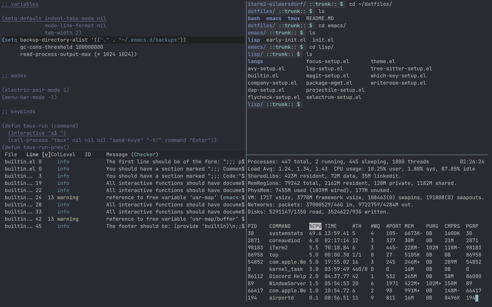
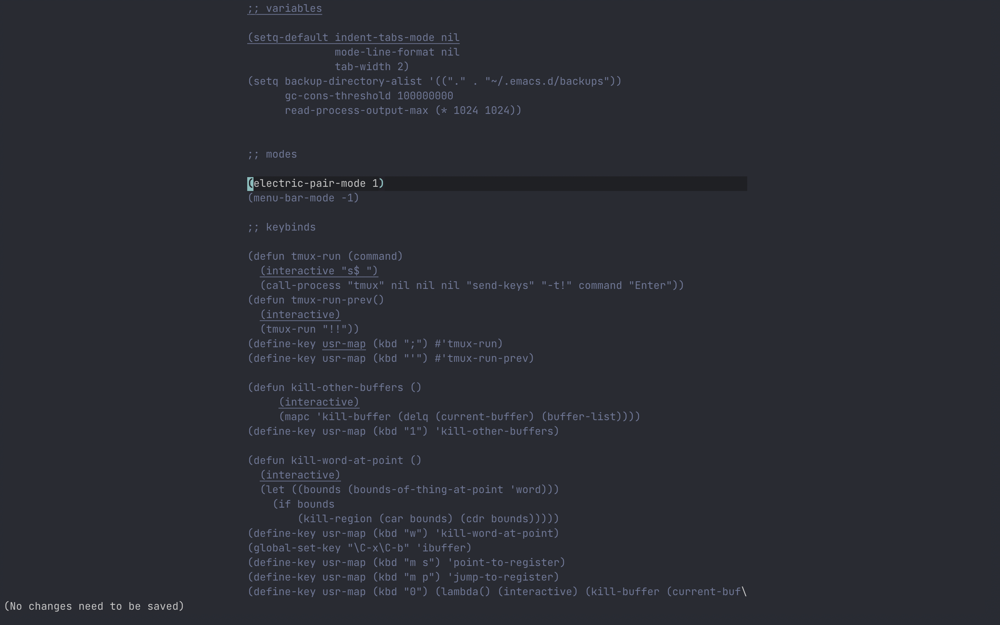
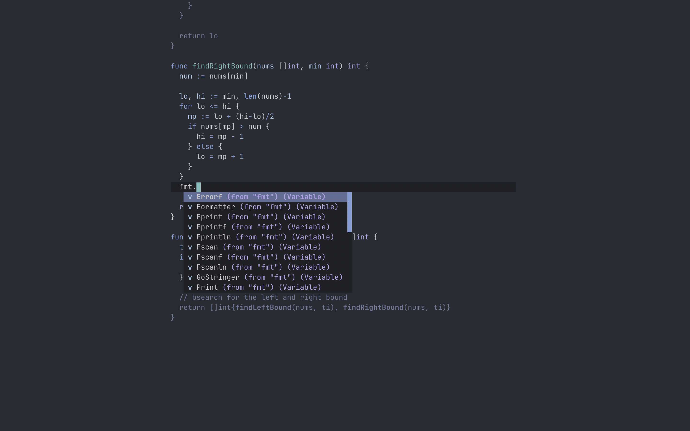
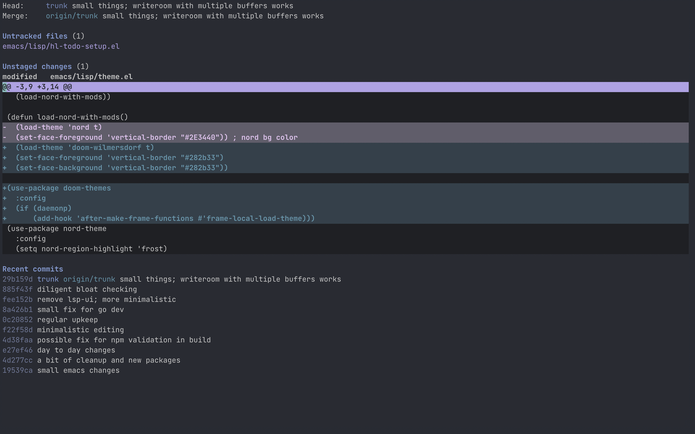

 # bbflower dotfiles

 
 
 
 
 
 **Uniform, lean dotfiles**
 
 ---
 
 
 

## Core Principles

- Attention sparing
    - ~modeline~, ~tmux statusline~, ~line numbers~, ~git-diff~
- Use defaults whenever reasonable
- Consistent, predictable keybinds across layers
    - e.g. `C-x 1`, `C-d 1`, `C-t 1` will isolate the emacs window, isolate the emacs buffer, and isolate the tmux pane, respectively.
- Configuration code **_must_** be simple, and its behavior obvious

## Install

> Notes:
> - Existing dotfiles (`.bash_profile`, `.tmux.conf`, `init.el`, `early-init.el`) are not symlinked
> - Run as `sudo` to change shell to `bash`
> - Sets `$EDITOR` to `emacsclient` - run `emacs --daemon` or `er (aliased in bash_profile)` prior to use. 

1. `git clone https://github.com/bbflower/dotfiles.git`
2. `bash dotfiles/bash/bootstrap.sh`

## Misc

- Font: [JetBrains Mono](https://www.jetbrains.com/lp/mono/) `14pt`
- iTerm line spacing: `105`

## Screenshots

 

 tuned distraction free editing, including peripheral text dimming a la focus-mode
 
 
 
 lsp integration and autocompletion
 
 
 
 embedded git porcelain via magit

 
 

